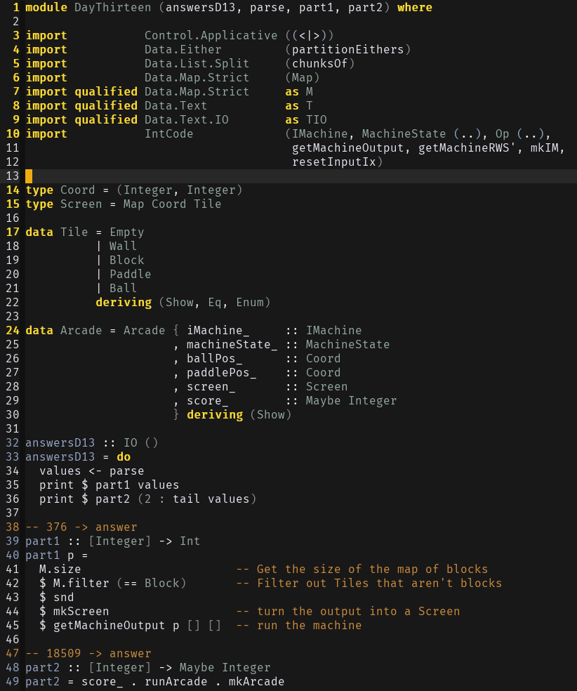
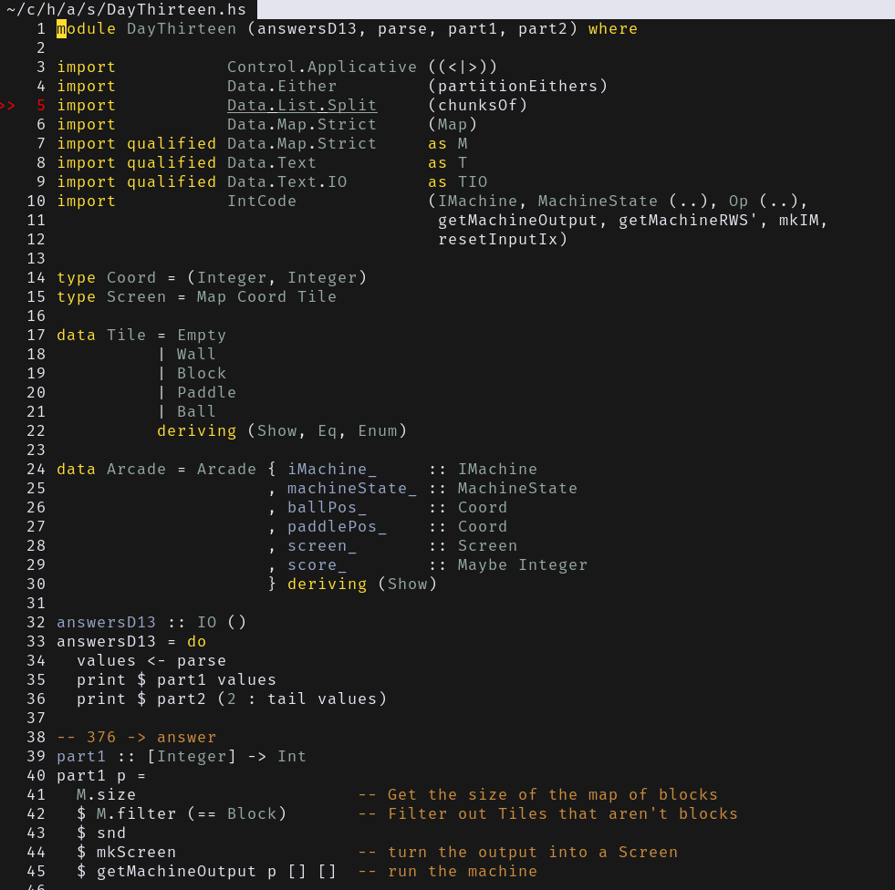

# Gruber Darker Theme

The original Gruber Darker Theme is an emacs theme located [here](https://github.com/rexim/gruber-darker-theme).
This is an in progress theme. Currently, It has bindings that really only work
for Haskell and python. Java is annoying and it depends on your ```.vimrc```.
I am adding theming as I use certain files.

## Notes

The theme supports 256 color vim versions. However, it will be more accurate if
you are using Nvim or a newer Vim and using ```set termguicolors```.

## Comparison Between Emacs and Vim

Here is the Emacs version for haskell bindings:


And Vim/NVim:


As you can see there are some slight differences.
I am working to try and find the proper syntax bindings to make the themes more
in line.

## TODO

- Create a statusline theme (probably airline)
- Expand bindings for more filetypes
